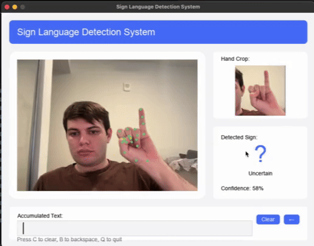

# AI Sign Language Project

## DEMO 
Below is a basic demo of the project using ASL! Enjoy <3


## Overview
This project aims to recognize and translate sign languages using a CNN model (LSTM). It leverages TensorFlow, Mediapipe, and NLP for feature extraction, model training, and text correction.

## Setup Instructions

### 1. Clone the Repository
Clone the repository to your local machine using Git:
```bash
git clone https://github.com/godinezsteven1/AI-SignLanguage.git
cd AI-SignLanguage
```

### 2. Create a Virtual Environment
Create a virtual environment to manage project dependencies:
```bash
python3 -m venv fai_project_env
```

Activate the virtual environment:
- **For macOS/Linux:**
  ```bash
  source fai_project_env/bin/activate
  ```
- **For Windows:**
  ```bash
  fai_project_env\Scripts\activate
  ```

### 3. Install Dependencies
Install the required Python packages using the `requirements.txt` file:
```bash
pip install -r requirements.txt
```

### 4. Verify Setup
To make sure everything is working, try running the `hand_tracking.py` script to ensure TensorFlow and Mediapipe are installed correctly.

```bash
cd scripts
python hand_tracking.py
```

If everything is set up correctly, you should see a window showing hand tracking in real time.

## Running the Project
In the root directory:
```bash
python sign_recognition_gui.py
```

------ 
## Environment Variables Setup -- Runing the Reddit Scrapper on your own!

This project uses environment variables for sensitive configuration. A template file `.env.example` is provided in the repository. Follow these steps to create your own `.env` file:
Where CLIENT_ID, CLIENT_SECRET, and USER_AGENT is found at 'https://www.reddit.com/prefs/apps' by creating your own API app key under _YOUR_ account.

1. **Copy the template file:**

   ```bash
   cp .env.example .env
   ```

2. **Fill in information:**
```bash
CLIENT_ID=your_client_id_here
CLIENT_SECRET=your_client_secret_here
USER_AGENT=your_user_agent_here
POST_LIMIT=NUMBER_LIMIT_HERE
```
In order to get this information please go on Reddit, click on your avatar → User Settings → scroll down to the "Apps" section. You can manage and create apps from there.

 ## Results

The model successfully recognizes and classifies signs in real-time across multiple sign languages.

### Sign Language Recognition Output

#### American Sign Language (ASL)


#### German Sign Language (DGS)


#### Spanish Sign Language (LSE)

   
